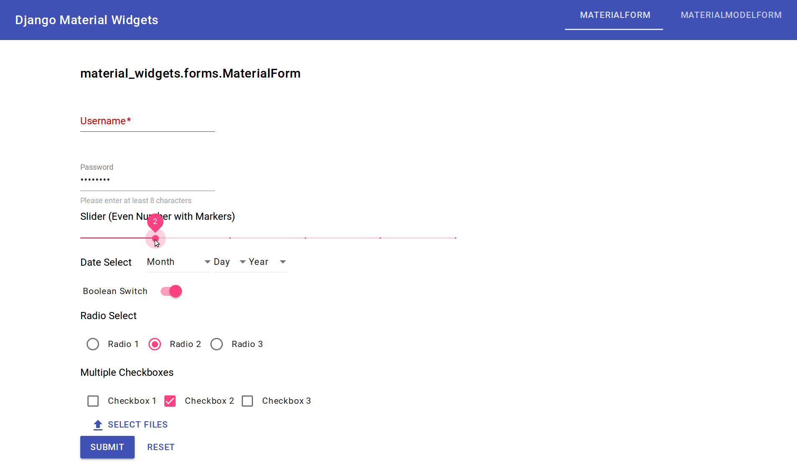

=======================
Django Material Widgets
=======================

Easily convert your Django Forms and ModelForms to use widgets styled with `Material Components for the Web`_.

|status| |docs| |pypi| |pyversion| |license|

|screenshot|

Quick Start
-----------
#) Install Django Material Widgets::

    pip install django-material-widgets

#) Add ``material_widgets`` to ``INSTALLED_APPS`` in your ``settings.py``::

    INSTALLED_APPS = [
        ...
        'material_widgets',
    ]

#) Edit your ``forms.py``:

    - Import ``material_widgets.widgets.MaterialForm`` and/or ``material_widgets.widgets.MaterialModelForm``::

        from material_widgets import MaterialForm, MaterialModelForm

    - Change forms using ``django.forms.Form`` and/or ``django.forms.ModelForm`` to ``MaterialForm`` or ``MaterialModelForm`` respectively::

        class MyForm(forms.Form): ⇨ class MyForm(MaterialForm):

        class MyModelForm(forms.ModelForm): ⇨ class MyModelForm(MaterialModelForm):

#) Edit your HTML templates:

    - Change ``{{ form }}`` template variables to ``{{ form.as_components }}``::

        {{ form.as_p }} ⇨ {{ form.as_components }}

    - Add ``{{ form.media.css }}`` to your ``<head>`` tag::

        <head>
            {{ form.media.css }}
        </head>

    - Add the ``mdc-typography`` CSS class to your ``<body>`` tag::

      <body class="mdc-typography">

    - Add ``{{ form.media.js }}`` to the bottom of your ``<body>`` tag::

        <body class="mdc-typography">
            ...

            {{ form.media.js }}
        </body>

    - (Optional) Add stylesheet links::

        <head>
            <link rel="stylesheet" href="https://fonts.googleapis.com/css?family=Roboto:300,400,500">
            <link rel="stylesheet" href="https://fonts.googleapis.com/icon?family=Material+Icons">
        </head>

Demo
----
https://ooknosi.github.com/django_material_widgets

To view the demo locally at ``http://localhost:8000``:

.. code:: bash

    git clone https://github.com/ooknosi/django_material_widgets.git
    cd django_material_widgets/src
    python manage.py migrate --settings=demo.settings
    python manage.py runserver --settings=demo.settings

Documentation
-------------
http://django-material-widgets.readthedocs.io/en/latest/

.. _Material Components for the Web: https://material.io/components/web/

.. |status| image:: https://img.shields.io/pypi/status/django-material-widgets.svg
            :target: https://pypi.python.org/pypi/django-material-widgets

.. |docs| image:: https://img.shields.io/readthedocs/django-material-widgets.svg
          :target: http://django-material-widgets.readthedocs.io/en/latest/

.. |pypi| image:: https://img.shields.io/pypi/v/django-material-widgets.svg
          :target: https://pypi.python.org/pypi/django-material-widgets

.. |pyversion| image:: https://img.shields.io/pypi/pyversions/django-material-widgets.svg
               :target: https://pypi.python.org/pypi/django-material-widgets

.. |license| image:: https://img.shields.io/pypi/l/django-material-widgets.svg
             :target: https://github.com/ooknosi/django_material_widgets/blob/master/LICENSE
